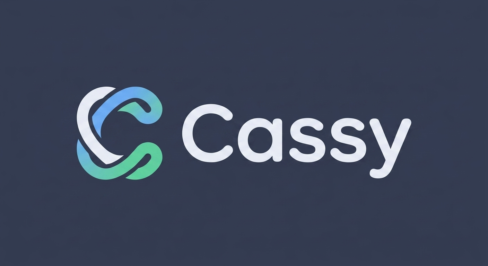

<div align="center">



**Multi-agent coding factory with persistent memory.**

[](LICENSE)
[](https://github.com/Richards-LLC/cassy/actions)
[](https://github.com/Richards-LLC/cassy/releases)

[Factory](#factory) · [Context System](#context-system) · [Knowledge](#knowledge) · [Quick Start](#quick-start) · [Installation](#installation) · [Architecture](#architecture) · [Contributing](CONTRIBUTING.md)


</div>

---

## What is Cassy?

Cassy is a multi-agent coding factory and persistent context system for AI coding agents. Three things live in one binary:

1. **Factory** — a terminal UI that runs a supervisor agent and a fleet of worker agents in parallel on one repository, each worker in its own git worktree. Workers can be Claude Code, Codex, or Grok — mixed in the same session.
2. **Context System** — an MCP server giving every agent persistent memory, tasks, rules, skills, entities and search, backed by SQLite and a Tantivy BM25 index.
3. **Knowledge** — a self-distilling wiki of the repository, built from its own docs and code, injected as a cheap index at session start and pulled on demand.

Everything is local-first. Cloud sync exists and is optional; nothing phones home when you are logged out.

## Factory

```bash
cas                   # launch the factory TUI (supervisor only)
cas -w 3              # launch with 3 workers, each in its own worktree
cas codex             # Codex as the supervisor
cas grok              # Grok as the supervisor
cas claude alt        # Claude supervisor signed in as the ~/.claude-alt account
cas claude login alt  # sign in only the alt profile without changing main
cas codex alt         # Codex supervisor signed in as the ~/.codex-alt account
cas codex login work  # sign in only the work profile without changing main
```

A supervisor plans epics, cuts tasks, assigns them, reviews the work and merges the branches. Workers claim one task at a time, work in an isolated checkout under `.cas/worktrees/`, and report back through the shared database. The TUI shows every agent side by side (or `--tabbed`), plus a sidecar with the active epic, the task list, the live diff and an activity feed.

| Capability | How it shows up |
|---|---|
| **Worktree isolation** | Each worker gets its own worktree + branch. `--no-worktrees` shares one directory, `--worktree-root` relocates them |
| **Mixed harnesses** | `--supervisor-cli` / `--worker-cli`, or per-slot `--worker-spec '{"name":"alice","cli":"codex","effort":"high"}'` |
| **Account selection** | `cas claude login <profile>` signs in one isolated Claude profile; `cas claude <profile>` launches it and spawned workers inherit the same config and credential store. `cas claude --list-profiles` asks Claude Code for each profile's real auth state. The same three commands exist for Codex (`cas codex login/…/--list-profiles`), scoped by `CODEX_HOME` |
| **No silent downgrades** | `--strict-cli` refuses to quietly reroute a Codex worker to Claude when Codex is unavailable |
| **Task coordination** | Tasks carry dependencies, priorities, leases and close gates — a close is refused when the branch is unmerged or the tree is unverifiable |
| **Session control** | `cas list`, `cas attach`, `cas kill`, `cas kill-all`; `--notify` for desktop alerts, `--record` for replayable sessions |
| **Liveness triage** | `cas factory is-wedged`, `debug`, `kill` classify and recover a stuck worker; `cas factory preflight` reports readiness before spawning |
| **Headless control** | `cas factory status|agents|activity|message` drive a running session without attaching a terminal |

### Bare Claude account picker

Claude Code's updater owns `~/.local/bin/claude` and replaces that entry with
its current binary, so a wrapper installed at that path will not survive an
update. Put this shell function in your interactive shell startup file instead
(for example `~/.zshrc`), then open a new terminal:

```bash
claude() { command cas claude --bare "$@"; }
```

With two or more logged-in Claude profiles, bare `claude` now offers a picker.
The picker is intentionally bypassed for non-interactive invocations, so
scripts keep Claude Code's normal argument and input behavior.

### Codex account profiles

Codex accounts follow the same convention: `main` is `~/.codex`, any other name
is `~/.codex-<name>`, and selecting one exports `CODEX_HOME` so the supervisor
pane and every Codex worker it spawns land on that account.

```bash
cas codex --list-profiles   # detected accounts and their real login state
cas codex login work        # create ~/.codex-work, seed it, run `codex login` there
cas codex work              # factory with Codex supervising on that account
cas codex work --workers 3  # factory flags still pass through, with or without a profile
cas codex --bare work       # plain Codex on that account instead of the factory
```

`cas codex` with more than one detected account, run in an interactive terminal,
stops and asks which account to use — it never silently loads a default. An
account whose login state cannot be determined is shown as unknown and stays
selectable rather than being hidden. The last entry in the picker is **new
login**: it asks for an email, creates `~/.codex-<email>`, seeds it, runs
`codex login` there, and launches on that account once it reports signed in.
Explicit `cas codex <profile>` and every non-interactive invocation skip the
prompt.

`cas codex login <name>` seeds a new profile home by symlinking the shared
configuration surface from `~/.codex` — `config.toml`, `AGENTS.md`, `agents/`,
`skills/`, `plugins/`, `hooks.json` — so a new account is immediately equipped.
Credentials are never shared: `auth.json` stays a real per-profile file, and the
seeder refuses it even if asked. Seeding is idempotent and never overwrites a
file you have since diverged. Because the shared entries are links, editing
config through one profile edits it for all of them by design (Cassy's own Codex
config writer resolves links before writing, so a managed link survives).

Selecting an account also scrubs inherited `OPENAI_API_KEY`, `CODEX_API_KEY` and
`CODEX_ACCESS_TOKEN`, so a key left in the environment cannot quietly override
the account you picked.

## Context System

`cas serve` speaks [MCP](https://modelcontextprotocol.io/). It exposes twelve umbrella tools — each dispatching dozens of actions — plus two proxy tools when upstream MCP servers are configured:

```
coordination, knowledge, memory, pattern, rule, search,
skill, spec, system, task, team, verification
```

```
# Remember something across sessions
mcp__cas__memory action=remember content="This project uses Zod for validation"

# Create and track work
mcp__cas__task action=create title="Implement auth" priority=1

# Search everything the project knows
mcp__cas__search action=search query="error handling patterns"

# Create a rule that syncs to .claude/rules/cas/
mcp__cas__rule action=create content="Always validate input at API boundaries"
```

| Surface | What it is |
|---|---|
| **Memory** | Learnings, preferences, context and observations that survive sessions, with tiers and importance; derived entries carry `source_ids` back to what they came from, and aged events/recordings compress into an append-only archive instead of being deleted |
| **Tasks** | Work items with dependencies, leases, structured notes, verification and merge-state close gates; each task carries a patchable execution state so a resuming worker gets a compact briefing instead of replaying history, and an `origin_project` identity keeps foreign tasks out of your ready queue |
| **Rules** | Normative constraints that earn trust through measured use — promotion to proven requires accumulated helpful evidence, harmful evidence demotes, and injection impact is counted per rule; every change is versioned, deletes are restorable tombstones; proven rules sync to `.claude/rules/cas/` |
| **Skills** | Procedural playbooks synced to `.claude/skills/`, shipped in Claude / Codex / Grok flavors; a skill can declare a `validation_script` that gates its own create/update, and edits are versioned with restore |
| **Search** | BM25 full-text over entries, tasks, rules, skills, specs and indexed code symbols |
| **Coordination** | Agent registry, messaging, worker spawn/shutdown, worktree operations — the factory's control plane |

**Search, honestly.** Local search is BM25 only (Tantivy), and the knowledge surface uses SQLite FTS5. There is no local embedder: semantic ranking exists only when you are logged in to the cloud, and the ranker redistributes a dead channel's weight instead of silently scaling every result down. See [ARCHITECTURE.md](cas-cli/docs/ARCHITECTURE.md) for the full accounting.

**Assets, in your project's style.** The built-in `cas-image-generate` skill harvests a project's design context — palette, motifs, typography feel — into style tokens and prompts Google's Nano Banana image models with them: logos, backgrounds, heroes, icon sheets, OG cards, report art. It supports reference images for style consistency, has a `--dry-run`, and degrades with explicit setup guidance when no key is present. Bring a Google AI Studio key as `GEMINI_API_KEY`; no other paid service is wired. The logo at the top of this page was generated with it.

## Knowledge

A project can explain itself instead of being re-read from scratch every session.

```bash
cas knowledge build --dry-run   # plan the pass, call no model, cost nothing
cas knowledge build             # distill changed sources into .cas/knowledge/
cas knowledge status            # ledger and page counts
cas knowledge list
cas knowledge search "hook scoring"
cas knowledge read cas-kn007    # by page id, or by path: subsystem/hooks.md
```

`build` is a two-stage ingest: it collects the repo's own documentation, README, agent instructions, key configuration and a summary of every indexed code module, then asks a model to turn changed sources into concise pages. Pages live as ordinary markdown under `.cas/knowledge/` — greppable, hand-editable and reviewable in a PR — with a canonical relative path, source provenance and a fingerprint ledger behind them. An unchanged source set produces no distillation work; a removed source can cascade away pages that no longer have provenance. Distillation calls a model, so it never runs on its own.

Knowledge is designed to be useful without making every prompt enormous:

- **Session start gets an index, not the bodies.** The startup briefing carries stable pointer lines — id, type, title and snippet — in a 600-token budget. It deliberately does not inject page bodies. Ask the `knowledge` MCP tool to `read` a known page, or `search` its titles, snippets and bodies when you do not yet know the page.
- **Hand-written text stays yours.** A locked page is never overwritten by distillation, cascade cleanup or an incoming cloud copy. `knowledge write` creates locked pages for this reason; locking an existing page gives it the same protection. The lock travels with a synced page, so collaboration does not weaken ownership.

### Bringing forward existing memory

Knowledge complements persistent memory; it does not erase it. `cas memory-migrate` is dry-run first: it opens legacy stores read-only, routes and audits every discovered row before writing anything, and records a ledger, audit and quarantine report. The migration is resumable and idempotent, while the audit fails rather than silently dropping an unrouted row. Records that should remain as legacy entries stay there; the point is a safe, accountable path into durable project pages, not a destructive conversion.

If you need to undo an applied migration, its rollback follows that ledger and removes only pages it can prove the migration wrote. Quarantined foreign or suspicious content is held back for review instead of being placed on the always-on project-knowledge surface.

Knowledge stays local-first: the SQLite metadata and markdown bodies are the source of truth. When optional Cloud sync is configured, pages and their ownership metadata can travel to teammates; a logged-out machine still has a complete local knowledge base.

## Quick Start

```bash
# Install (Linux x86_64 or macOS Apple Silicon)
curl -fsSL https://raw.githubusercontent.com/Richards-LLC/cassy/main/scripts/cas-install.sh | bash

# Complete the machine setup and initialize this project — login, pairing,
# hub service, optional Viktor, hooks, builtins, and cloud sync are guided here
cd your-project
cas setup --project "$PWD"

# Check the install
cas doctor

# Launch the factory
cas
```

## Installation

### Linux (x86_64)

```bash
curl -fsSL https://raw.githubusercontent.com/Richards-LLC/cassy/main/scripts/cas-install.sh | bash
```

Installs the latest release binary to `~/.local/bin/cas`. Override with `CAS_INSTALL_DIR`, `CAS_VERSION`, or `CAS_REPO`.

Pipe it to `bash`, not `sh` — a piped script has no shebang, and the installer
is written for bash.

Before extracting anything, the installer requires the selected archive's
SHA-256 from the published GitHub Release metadata and verifies the downloaded
bytes. A missing digest or mismatch aborts without replacing an existing
binary. This is a corruption-detection boundary, not independent publisher
authentication: the archive and digest come from the same GitHub repository
authority, and Cassy does not currently name a separate signing or attestation
trust root.

If the install directory is not already on your PATH, the installer offers to
add a marker-guarded guard to your **login** shell's startup file (`.zshenv` for
zsh, `.bashrc` or `.profile` for bash), and re-running it never adds the block
twice. It then verifies by running `cas --version` in a fresh login shell and
reports success only when that works. Decline with `CAS_WIRE_PATH=0` (it prints
the exact line instead), accept without a prompt with `CAS_WIRE_PATH=1`; an
unattended run with no terminal available never edits a startup file.

### macOS (Apple Silicon)

```bash
curl -fsSL https://raw.githubusercontent.com/Richards-LLC/cassy/main/scripts/cas-install.sh | bash
```

The installer downloads the release asset for Apple Silicon and clears its
macOS quarantine attribute after installation. Intel Macs do not have a
published release asset; build from source instead. A full from-zero Mac
walkthrough lives in [docs/onboarding/macbook-from-zero.md](docs/onboarding/macbook-from-zero.md).

### Build from source

Building links the vendored libghostty-vt terminal engine, which needs a Zig compiler. The build script looks for `$ZIG`, then `zig` on `PATH`, then `.context/zig/zig`.

```bash
git clone https://github.com/Richards-LLC/cassy.git
cd cassy
./scripts/bootstrap-zig.sh          # or: brew install zig / your package manager
export ZIG="$PWD/.context/zig/zig"  # skip if zig is already on PATH
cargo build --profile release-fast  # binary at target/release-fast/cas
```

`cargo build --release` produces a smaller, slower-to-build binary. Rust 1.85+ (edition 2024) is required.

### Staying current

```bash
cas update              # self-update from this repo's GitHub releases
cas update --schema-only  # apply pending database migrations only
cas changelog           # release notes
```

## CLI

```bash
cas                   # launch the factory TUI
cas -w 3              # ...with 3 workers
cas claude|codex|grok # choose the supervisor harness (all factory flags pass through)
cas claude login alt  # isolate login to ~/.claude-alt (main stays untouched)
cas codex login alt   # isolate login to ~/.codex-alt (main stays untouched)
cas open              # interactive project picker
cas setup             # guided machine setup; optionally pass --project DIR
cas init              # initialize Cassy in the current project
cas serve             # run the MCP server
cas doctor            # diagnostics (see below)
cas knowledge ...     # distilled project wiki
cas attach|list|kill  # factory session control
cas status            # session status snapshot
cas config list       # every setting, current vs default
cas config describe cloud.auto_sync
cas worktree sweep    # worktree diagnostics and cleanup (cas sweep-all for every repo)
cas bridge serve      # local HTTP control/status API for external orchestrators
cas login             # Cassy Cloud (optional)
cas cloud sync        # push + pull (optional)
```

### Editor integration

`cas init` wires this up for you. To do it by hand, add Cassy to `.mcp.json` (Claude Code and Grok both read it) or your Claude Code settings:

```json
{
  "mcpServers": {
    "cas": {
      "command": "cas",
      "args": ["serve"]
    }
  }
}
```

Cassy ships builtin skills (`cas-code-review`, `cas-worker`, `cas-github-issues`, `codemap`, …) in Claude, Codex and Grok flavors, kept in lockstep by a parity test. If they crowd your context, Claude Code's `skillOverrides` in `settings.json` can set any skill to `"off"`, `"user-invocable-only"`, or `"name-only"` without disabling Cassy.

### Viktor delegation

`cas init` installs the `cas-viktor` skill in the Claude, Codex, and Grok mirrors. For a
credential-safe setup check, run `cas viktor`. If no credential is configured, get an
operator-issued key and enter it once with `cas viktor key` (paste it when prompted); Cassy validates
the non-spending MCP handshake before storing the key only for this machine. Invalid or expired
keys are not saved. Start a new CAS session after setup. `cas viktor` identifies the managed user
configuration and explains any project policy override without printing the key. `cas serve`
loads the machine credential into its managed, credential-reference-only Viktor upstream and exact
conversation allowlist. Agents use the proxy's `mcp_search`/`mcp_execute` surface, and CAS delivers
completed answers as inbound notifications instead of requiring agent-side polling. A committed
`.cas/proxy.toml` opts out of the managed default, so it must explicitly configure the required
Viktor server and routes.

## Diagnostics

```bash
cas doctor                # database, schema, index, config, sync target, MCP wiring
cas doctor --fix          # initialize and apply pending migrations
cas doctor --foreign-rows # full list of cross-project rows in this database
```

Doctor reports which cloud bucket the project resolves to and why, warns when two local projects claim the same one, and detects rows replicated from other projects. Foreign rows are matched on `(id, title)` together — never on id alone, because short task ids genuinely collide across projects, so an id-only sweep would delete live work. The report is read-only; nothing is deleted or modified by it.

## Architecture

### On disk

```
.cas/
├── cas.db          # SQLite — memories, tasks, rules, skills, entities, agents
├── config.toml     # project configuration
├── knowledge/      # distilled wiki pages (markdown)
├── archive/        # compressed, write-once event/recording trace archives
├── index/          # tantivy/ (BM25), code/ (symbols), knowledge-vectors/
├── logs/           # daily rolling logs
└── worktrees/      # factory worker checkouts
```

Host-level state (session registry, known repos, recordings, `[factory.defaults]`) lives in `~/.cas/`; the cross-project "global" memory scope lives in `~/.config/cas/`.

### Workspace

One binary crate (`cas-cli`) plus 16 libraries under `crates/`:

| Crate | Purpose |
|-------|---------|
| `cas-cli` | CLI, MCP server, factory TUI, daemon, bridge |
| `cas-factory` / `cas-factory-protocol` | Spawn pipeline, spec resolution, supervisor↔worker wire types |
| `cas-mux` / `cas-pty` | Terminal multiplexer and PTY management for agent panes |
| `cas-core` | Business logic, hooks, session-start context assembly |
| `cas-store` | SQLite storage layer, schema, migrations |
| `cas-search` | BM25 index (Tantivy) + vector store and score combination |
| `cas-code` | Code indexing and symbol search (tree-sitter) |
| `cas-mcp` / `cas-mcp-proxy` | MCP protocol types/handlers and upstream proxy engine |
| `cas-types` | Shared data types |
| `cas-diffs` | Diff parsing, rendering, syntax highlighting |
| `cas-recording` | Terminal session recording and playback |
| `cas-tui-test` | PTY-based TUI test framework |
| `ghostty_vt` / `ghostty_vt_sys` | Virtual terminal parser (vendored libghostty-vt) |

Built with Rust, SQLite, Tantivy, Ratatui, Ghostty VT and rmcp.

Deeper material: [ARCHITECTURE.md](cas-cli/docs/ARCHITECTURE.md) (crates, stores, hook scoring, search reality check) · [CONTRIBUTING.md](cas-cli/docs/CONTRIBUTING.md) (adding commands, MCP tools, migrations, tests) · [CODEMAP.md](.claude/CODEMAP.md) (module-level navigation) · [CHANGELOG.md](CHANGELOG.md).

Trace retention: [TRACE-ARCHIVES.md](docs/TRACE-ARCHIVES.md) describes the
30-day live window, compressed archive format, finite byte cap, read API, and
upgrade behavior for traces removed by older versions.

## Cloud (optional)

Cassy is fully usable offline; the cloud adds sync across machines, semantic search and team sharing.

```bash
cas login                        # browser device flow
cas login --token <API-TOKEN>    # or a token, from any directory
cas cloud status                 # what is pending, what is embedded
cas cloud sync                   # push then pull
```

Log in once per machine, not once per project. Credentials live at user level in `~/.cas/cloud.json`, so every project you `cas init` afterwards is already authenticated, `cas login` and `cas whoami` work outside a project too, and `cas logout` signs the machine out. Each project keeps its own `.cas/cloud.json` for project state (team link, sync watermarks) and a cached copy of the credential.

Sync is project-scoped: a push or pull that cannot determine which project it is running in refuses to make the request rather than sending or asking for everything. Personal pushes are incremental: `cas cloud push` consumes the current project's pending `sync_queue` rows, removing successful rows while leaving failures retryable. `--dry-run` previews the next bounded queue batch; `--entries-only` and `--tasks-only` narrow both that plan and the real push. `cas doctor` tells you which bucket a project resolves to; `cas cloud project set` pins it explicitly.

### Teams

After an admin creates a team in the dashboard:

```bash
cas login                             # single-team users are auto-scoped
cas cloud team default <team-slug>    # multi-team: pick a user-wide default
cas cloud team set <uuid>             # per-project override
cas cloud team-memories               # pull the team's memories for this project
cas cloud unlink                       # detach this project locally; keep local data
cas cloud unlink --purge-remote       # detach and remove owned cloud rows first
```

`cas cloud unlink` removes only the project's `.cas/cloud.json` link file; the
local database and other `.cas` data remain untouched. `--purge-remote` first
discovers the project's personal and active-team entries, tasks, and knowledge
rows through project-scoped pulls and uses the existing per-owner DELETE paths.
It fails closed (and preserves the local link) when discovery is incomplete,
the cloud cannot delete a row, or knowledge-page rows are present on a server
that does not support their DELETE endpoint. Use `--dry-run` to inspect the
scoped purge plan without changing local or remote state.

Project-scoped, non-preference memories then dual-enqueue to the team queue automatically. Preference-typed and global-scoped entries always stay personal. Backfill existing entries with `cas memory share --dry-run --all` (then without `--dry-run`), `--since 7d`, or one id at a time; `cas memory unshare <id>` reverses it. Set `team_auto_promote: false` in `~/.cas/cloud.json` to pause promotion without clearing the team.

### Remote sessions

With devices registered (`cas device`), `cas attach --remote <device>:<factory-id>` resolves the device's SSH host from the cloud API and hands you the remote session; `--worker <name>` focuses one pane. `cas bridge serve` exposes a token-authenticated local HTTP API for external orchestration tools.

## Contributing

This repository is where Cassy development happens; it began as a fork of a source-available upstream project and has moved a long way since. Bug reports and feature suggestions are welcome through [Issues](https://github.com/Richards-LLC/cassy/issues) and [Discussions](https://github.com/Richards-LLC/cassy/discussions); PRs are considered case by case.

See [CONTRIBUTING.md](CONTRIBUTING.md).

## License

[MIT](LICENSE)
