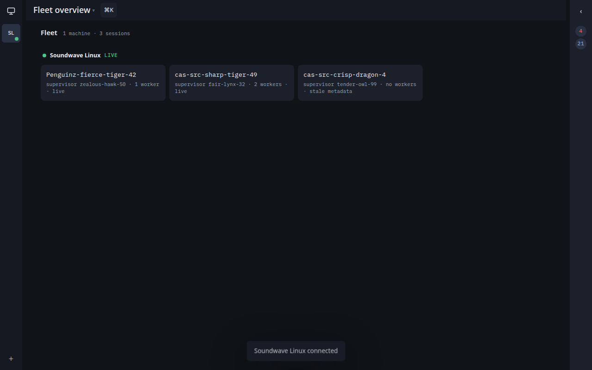
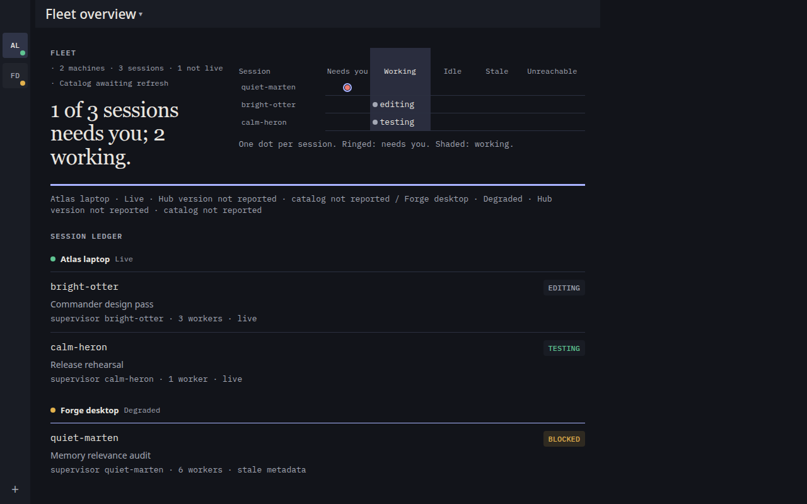
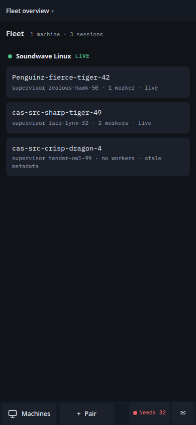
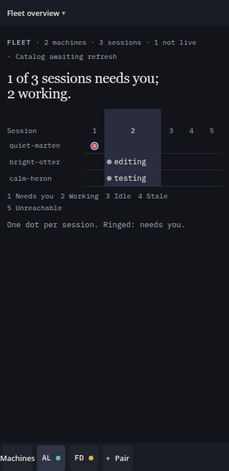

# Commander design pass — final critique gate (Unit 7)

**Verdict: the epic proceeds to release prep.** The assembled Commander on the integrated epic
tip `698dbaba` scores 4 / 5 / 4 / 4 / 4 against the cas-ui-craft rubric (floor: distinctiveness,
fit, hierarchy ≥ 4; no 0), and the strict visual-QA row is green on every fixture in both schemes
at both viewports: **PASS 9 fixtures × 2 schemes × 2 viewports, 0 findings, 8 allowlisted**.
The baseline's 4,722 mechanical findings across seven classes are 0. Four send-backs are filed
below; none is a product defect on the assembled tree, so none holds the gate — three are fixture
and runner corrections owned by Unit 6, one is a hardening item for Unit 5.

Scored by watchful-jaguar-3 on 2026-09-07 from the strict run at
`/home/pippenz/.cas/artifacts/cas-b296/visual-qa/` (generated 14:11:26Z) and the geometry
probes under `/home/pippenz/.cas/artifacts/cas-b296/probe/`.

## Before / after

The claim of the brief is that the fleet is drawn, not listed. The 3.17.3 board is three equal
cards under a heading and two count badges; the design-pass board is a serif verdict beside a
dot plot whose one ringed dot outside the *Working* band is the session that needs the operator.

| | Before (3.17.3, live hub, dark) | After (epic tip, fixture, dark) |
| --- | --- | --- |
| 1280 |  |  |
| 390 |  |  |

Light counterpart of the hero: [1280](captures/after/gate/fleet-populated.1280.light.png),
[390](captures/after/gate/fleet-populated.390.light.png). The phone hero ends at the figure's
caption because the board scrolls inside `.pane-grid` (`overflow-y: auto`, 372 px viewport /
933 px content, probe `probe2.mjs`); the provenance rule and the session ledger sit below the
fold and are reachable by scroll — [scrolled light](captures/after/gate/fleet-populated.390.light.scrolled.png),
[scrolled dark](captures/after/gate/fleet-populated.390.dark.scrolled.png). A full-page
screenshot cannot show an inner scroll container, which is why the gate capture stops at the
caption.

Second echo of the move, below the fold: the attention rail as an annotated timeline —
[before](captures/before/attention-rail.1280.dark.png) (stacked cards, hover-only dismiss
glyphs, two-line clamp) → [after](captures/after/gate/attention-12.1280.dark.png) (spine, mono
timestamps, the critical event carrying the `verdict` marker, every action as visible text).

## Scores

| Dimension | Before (3.17.3) | After | Evidence |
| --- | ---: | ---: | --- |
| Distinctiveness | 2 | **4** | Serif verdict over warm paper / graphite, mono for everything machine-minted, hairlines and one indigo mark per screen; the move (a fleet as dots on a track) is on the first screen and echoed once by the attention timeline. Not 5: the connection-failed fixture does not render the production serif verdict + attempt timeline (send-back 1), so the assembled set shows the echo once, not twice. |
| Fit to argument | 1 | **5** | At 1280 the figure's shape is the claim: `quiet-marten` is the one ringed dot on *Needs you* above two dots inside the shaded *Working* band; the sentence "1 of 3 sessions needs you; 2 working." only names it. At 390 the track becomes numbered columns with a full-word legend line under the plot — the ring and the band still carry the shape without reading. |
| Hierarchy | 2 | **4** | Verdict sentence (display serif, 34 px), figure, 3 px `verdict` rule, provenance at `meta`, then the ledger a clear step down. The `4`/`75` badges are gone. Not 5: the ledger's boxed phase chips (`EDITING`, `TESTING`, `BLOCKED`) restate the figure in a second visual vocabulary, and at 390 the `Fleet overview ▾` header row sits close to the verdict's weight. |
| Craft | 0 | **4** | `npm run visual-qa` (strict, light + dark, 1280 + 390): **PASS 9 fixtures x 2 schemes x 2 viewports**, 0 findings; contrast, clipping, overlap, overflow, viewport-escape and print classes all 0 (receipt below). Seams that stop it at 4, none mechanical: the 13-character fixture pairing code (`CAS-7Q4M-2P9K`) scrolls inside `.pair-flow` (`scrollWidth` 563 / `clientWidth` 488 at 1280) where the product's 9-character `K7MW-4H2Q` fits (send-backs 2 and 4); the transcript fixture's box-drawing fragment (`┌────`) prints as a lone rule; at 1280 with three sessions the board overruns `.pane-grid` by 23 px of bottom padding. |
| Accessibility | 0 | **4** | Every text-on-surface pair ≥ 4.5:1 in both schemes (0 `contrast` findings, none allowlisted); 0 `print-loss`; `outside-viewport` 0 at 390; `invisible-text` 0 (no hover-only affordance remains — every attention action is visible text). Keyboard: Unit 3's `browser-proof.mjs` (palette reopen with focus return, drawer `inert`/`aria-hidden`, ledger session by keyboard) and Unit 4's `browser-behavior.mjs` (wide diagrams scroll in keyboard-reachable rows). The one caveat is the class-wide `javascript-disabled-loss` allowance: the Commander is a JavaScript application and its `<noscript>` line says so. |

Floor holds: distinctiveness 4, fit 5, hierarchy 4; no dimension at 0.

## Strict visual-QA receipt

Command, run once on the integrated tip from `hub-web/` after `npm ci`:

```sh
git rev-parse HEAD            # 698dbaba — Merge branch 'factory/noble-phoenix-11' into HEAD
npm run visual-qa -- --artifact-dir /home/pippenz/.cas/artifacts/cas-b296/visual-qa
# PASS 9 fixtures x 2 schemes x 2 viewports   (exit 0)
```

Receipt: `/home/pippenz/.cas/artifacts/cas-b296/visual-qa/visual-qa.md` and `visual-qa.json`
(36 screenshots); the small `visual-qa.md` is committed at
[visual-qa/visual-qa.md](visual-qa/visual-qa.md). One line per fixture × scheme × viewport,
each linked to its capture under [captures/after/gate/](captures/after/gate/):

- PASS `fleet-populated` · light · 1280×800 — 0 findings · 1 allowlisted (javascript-disabled-loss) — [fleet-populated.1280.light.png](captures/after/gate/fleet-populated.1280.light.png)
- PASS `fleet-populated` · light · 390×800 — 0 findings · 1 allowlisted (javascript-disabled-loss) — [fleet-populated.390.light.png](captures/after/gate/fleet-populated.390.light.png)
- PASS `fleet-populated` · dark · 1280×800 — 0 findings · 1 allowlisted (javascript-disabled-loss) — [fleet-populated.1280.dark.png](captures/after/gate/fleet-populated.1280.dark.png)
- PASS `fleet-populated` · dark · 390×800 — 0 findings · 1 allowlisted (javascript-disabled-loss) — [fleet-populated.390.dark.png](captures/after/gate/fleet-populated.390.dark.png)
- PASS `fleet-empty` · light · 1280×800 — 0 findings — [fleet-empty.1280.light.png](captures/after/gate/fleet-empty.1280.light.png)
- PASS `fleet-empty` · light · 390×800 — 0 findings — [fleet-empty.390.light.png](captures/after/gate/fleet-empty.390.light.png)
- PASS `fleet-empty` · dark · 1280×800 — 0 findings — [fleet-empty.1280.dark.png](captures/after/gate/fleet-empty.1280.dark.png)
- PASS `fleet-empty` · dark · 390×800 — 0 findings — [fleet-empty.390.dark.png](captures/after/gate/fleet-empty.390.dark.png)
- PASS `session-canvas` · light · 1280×800 — 0 findings — [session-canvas.1280.light.png](captures/after/gate/session-canvas.1280.light.png)
- PASS `session-canvas` · light · 390×800 — 0 findings — [session-canvas.390.light.png](captures/after/gate/session-canvas.390.light.png)
- PASS `session-canvas` · dark · 1280×800 — 0 findings — [session-canvas.1280.dark.png](captures/after/gate/session-canvas.1280.dark.png)
- PASS `session-canvas` · dark · 390×800 — 0 findings — [session-canvas.390.dark.png](captures/after/gate/session-canvas.390.dark.png)
- PASS `transcript` · light · 1280×800 — 0 findings — [transcript.1280.light.png](captures/after/gate/transcript.1280.light.png)
- PASS `transcript` · light · 390×800 — 0 findings — [transcript.390.light.png](captures/after/gate/transcript.390.light.png)
- PASS `transcript` · dark · 1280×800 — 0 findings — [transcript.1280.dark.png](captures/after/gate/transcript.1280.dark.png)
- PASS `transcript` · dark · 390×800 — 0 findings — [transcript.390.dark.png](captures/after/gate/transcript.390.dark.png)
- PASS `attention-0` · light · 1280×800 — 0 findings — [attention-0.1280.light.png](captures/after/gate/attention-0.1280.light.png)
- PASS `attention-0` · light · 390×800 — 0 findings — [attention-0.390.light.png](captures/after/gate/attention-0.390.light.png)
- PASS `attention-0` · dark · 1280×800 — 0 findings — [attention-0.1280.dark.png](captures/after/gate/attention-0.1280.dark.png)
- PASS `attention-0` · dark · 390×800 — 0 findings — [attention-0.390.dark.png](captures/after/gate/attention-0.390.dark.png)
- PASS `attention-12` · light · 1280×800 — 0 findings — [attention-12.1280.light.png](captures/after/gate/attention-12.1280.light.png)
- PASS `attention-12` · light · 390×800 — 0 findings — [attention-12.390.light.png](captures/after/gate/attention-12.390.light.png)
- PASS `attention-12` · dark · 1280×800 — 0 findings — [attention-12.1280.dark.png](captures/after/gate/attention-12.1280.dark.png)
- PASS `attention-12` · dark · 390×800 — 0 findings — [attention-12.390.dark.png](captures/after/gate/attention-12.390.dark.png)
- PASS `connection-failed-retry` · light · 1280×800 — 0 findings — [connection-failed-retry.1280.light.png](captures/after/gate/connection-failed-retry.1280.light.png)
- PASS `connection-failed-retry` · light · 390×800 — 0 findings · 2 allowlisted (content-overflow, clipped-content) — [connection-failed-retry.390.light.png](captures/after/gate/connection-failed-retry.390.light.png)
- PASS `connection-failed-retry` · dark · 1280×800 — 0 findings — [connection-failed-retry.1280.dark.png](captures/after/gate/connection-failed-retry.1280.dark.png)
- PASS `connection-failed-retry` · dark · 390×800 — 0 findings · 2 allowlisted (content-overflow, clipped-content) — [connection-failed-retry.390.dark.png](captures/after/gate/connection-failed-retry.390.dark.png)
- PASS `pairing-step-1` · light · 1280×800 — 0 findings — [pairing-step-1.1280.light.png](captures/after/gate/pairing-step-1.1280.light.png)
- PASS `pairing-step-1` · light · 390×800 — 0 findings — [pairing-step-1.390.light.png](captures/after/gate/pairing-step-1.390.light.png)
- PASS `pairing-step-1` · dark · 1280×800 — 0 findings — [pairing-step-1.1280.dark.png](captures/after/gate/pairing-step-1.1280.dark.png)
- PASS `pairing-step-1` · dark · 390×800 — 0 findings — [pairing-step-1.390.dark.png](captures/after/gate/pairing-step-1.390.dark.png)
- PASS `pairing-cleanup` · light · 1280×800 — 0 findings — [pairing-cleanup.1280.light.png](captures/after/gate/pairing-cleanup.1280.light.png)
- PASS `pairing-cleanup` · light · 390×800 — 0 findings — [pairing-cleanup.390.light.png](captures/after/gate/pairing-cleanup.390.light.png)
- PASS `pairing-cleanup` · dark · 1280×800 — 0 findings — [pairing-cleanup.1280.dark.png](captures/after/gate/pairing-cleanup.1280.dark.png)
- PASS `pairing-cleanup` · dark · 390×800 — 0 findings — [pairing-cleanup.390.dark.png](captures/after/gate/pairing-cleanup.390.dark.png)

Both schemes are rendered by headless Chromium under `prefers-color-scheme`; the phone
viewport of the fixture runner is 390×**800** (`hub-web/scripts/visual-qa.mjs`
`REQUIRED_VIEWPORTS`), not the 390×844 the plan names (send-back 3).

### Allowlist review

`hub-web/visual-qa-allowlist.json` has eight entries. Six were not needed on this run; the two
that matched are the sanctioned `h1` codename ellipsis. No `contrast`, `overlapping-text`,
`outside-viewport`, `invisible-text` or `print-loss` entry exists.

| Entry (type · selector) | Matched on this run | Position |
| --- | --- | --- |
| `javascript-disabled-loss` · `body` | fleet-populated × light/dark × 1280/390 (4) | Accepted per plan: class-wide, the only one; `<noscript>` states the loss. |
| `clipped-content` · `.session-picker-toggle > .session-picker-name` | connection-failed-retry × light/dark × 390 (2) | Accepted per plan: single-line `h1` codename with `title`; the picker shows it whole. |
| `content-overflow` · same selector | same (2) | Companion finding of the same ellipsis. |
| `clipped-content` / `content-overflow` / `truncated-container` · `.pane.collapsed` | 0 | Reasoned and scoped; unused on this tree. |
| `clipped-content` / `outside-viewport` · `.terminal-mount` | 0 | Reasoned and scoped; unused on this tree (fixtures mount placeholder wells). |

### Delta against the baseline

Baseline counts are the seven live screens at 390 and 1280 in dark from
`captures/before/baseline-visual-qa.json` (see `visual-qa-plan.md`); the after counts are the
nine fixtures in both schemes at both viewports.

| Class | Before (dark only, 14 captures) | After (36 captures) | Allowlisted after |
| --- | ---: | ---: | ---: |
| `contrast` | 864 | 0 | 0 |
| `invisible-text` | 821 | 0 | 0 |
| `clipped-content` | 2,097 | 0 | 2 (`h1` ellipsis at 390) |
| `content-overflow` | 575 | 0 | 2 (same node) |
| `truncated-container` | 362 | 0 | 0 |
| `outside-viewport` | 2 | 0 | 0 |
| `overlapping-text` | 1 | 0 | 0 |
| `print-loss` | 0 (unpaired only) | 0 | 0 |
| `javascript-disabled-loss` | 2 (unpaired only) | 0 | 4 (class, `body`) |

The plan's named deltas all land: `contrast` → 0 with no allowlist entry; the three
`.attention-detail` classes → 0 (the detail is shown whole behind a `▸ Details` disclosure);
`outside-viewport` → 0 at 390; `invisible-text` → 0 — better than the plan's "reduced to the
two scoped drawer/toast entries", because the fixtures do not carry a closed drawer or a resting
toast and no such entry was needed.

## Per-screen notes

| Fixture | 1280 | 390 | Notes |
| --- | --- | --- | --- |
| `fleet-populated` | [light](captures/after/gate/fleet-populated.1280.light.png) · [dark](captures/after/gate/fleet-populated.1280.dark.png) | [light](captures/after/gate/fleet-populated.390.light.png) · [dark](captures/after/gate/fleet-populated.390.dark.png) | Hero as specified: mono eyebrow, serif verdict at 22ch, dot plot with the `verdict` ring on `quiet-marten`, phase words inside the band, 3 px rule, mono provenance, ruled ledger grouped by machine. At 390 the verdict stacks above the plot and eight 28 px rows fit; columns are numbered with a full-word legend. Ledger and provenance below the fold, reachable by scroll. |
| `fleet-empty` | [light](captures/after/gate/fleet-empty.1280.light.png) · [dark](captures/after/gate/fleet-empty.1280.dark.png) | [light](captures/after/gate/fleet-empty.390.light.png) · [dark](captures/after/gate/fleet-empty.390.dark.png) | Rule, title, one sentence, one primary action; the rail is hidden with no machine. |
| `session-canvas` | [light](captures/after/gate/session-canvas.1280.light.png) · [dark](captures/after/gate/session-canvas.1280.dark.png) | [light](captures/after/gate/session-canvas.390.light.png) · [dark](captures/after/gate/session-canvas.390.dark.png) | Terminal wells are the darkest thing on the page in both schemes; pane chrome is an eyebrow row (dot, mono codename, role, elapsed, text actions). At 390 the workers are a ruled list of 32 px rows. |
| `transcript` | [light](captures/after/gate/transcript.1280.light.png) · [dark](captures/after/gate/transcript.1280.dark.png) | [light](captures/after/gate/transcript.390.light.png) · [dark](captures/after/gate/transcript.390.dark.png) | 15/22 mono at a 68ch measure with hanging indents; wraps at 390 with no horizontal scroll; unfamiliar output preserved literally. |
| `attention-12` | [light](captures/after/gate/attention-12.1280.light.png) · [dark](captures/after/gate/attention-12.1280.dark.png) | [light](captures/after/gate/attention-12.390.light.png) · [dark](captures/after/gate/attention-12.390.dark.png) | Annotated timeline: `line-strong` spine, mono elapsed labels on the spine, the critical event marked in `verdict` colour, Retry / Dismiss / Details as visible text; the long codename wraps in the group header instead of `gabber-st…`. |
| `attention-0` | [light](captures/after/gate/attention-0.1280.light.png) · [dark](captures/after/gate/attention-0.1280.dark.png) | [light](captures/after/gate/attention-0.390.light.png) · [dark](captures/after/gate/attention-0.390.dark.png) | "All clear" with one line of context; no empty box. |
| `connection-failed-retry` | [light](captures/after/gate/connection-failed-retry.1280.light.png) · [dark](captures/after/gate/connection-failed-retry.1280.dark.png) | [light](captures/after/gate/connection-failed-retry.390.light.png) · [dark](captures/after/gate/connection-failed-retry.390.dark.png) | **Stand-in.** The fixture hand-builds `.empty-title` + two `.terminal-connecting-step` lines ("Attempt 3 · 12s elapsed · reconnecting in 8s") + "Try again / Connection log" — the sans title and amber step line the brief retired — rather than the production `.terminal-connecting-title` serif verdict and `ol.connection-timeline` (`hub-web/src/main.ts:995–1030`). The production surface passed strict in Unit 5's own render ([1280 light](captures/after/unit5-connection-light-1280.png), `/home/pippenz/.cas/artifacts/cas-408e/`). Send-back 1. |
| `pairing-step-1` | [light](captures/after/gate/pairing-step-1.1280.light.png) · [dark](captures/after/gate/pairing-step-1.1280.dark.png) | [light](captures/after/gate/pairing-step-1.390.light.png) · [dark](captures/after/gate/pairing-step-1.390.dark.png) | Hero number over a 3 px rule, term/value ledger with hairlines, status row, Cancel + one primary. Two fixture artifacts: the dialog is `open` in flow (not `showModal()`), so it renders below the shell at y = 800 and appears only in the full-page capture; and the 13-character code scrolls inside `.pair-flow`. Send-backs 2 and 4. |
| `pairing-cleanup` | [light](captures/after/gate/pairing-cleanup.1280.light.png) · [dark](captures/after/gate/pairing-cleanup.1280.dark.png) | [light](captures/after/gate/pairing-cleanup.390.light.png) · [dark](captures/after/gate/pairing-cleanup.390.dark.png) | Copy and step order unchanged (cas-8051 / cas-7d55); surfaces restyled; live status row present. Same in-flow dialog artifact as above. |

## Send-backs

None blocks: each is a fixture, runner, or hardening correction; the product tree has no
mechanical defect on this run. Filed as notes on the owning units.

| # | Owner | Defect | Exact node / fix |
| --- | --- | --- | --- |
| 1 | Unit 6 (cas-211c) — fixtures | `connection-failed-retry` does not render the production connection-failed surface; the gate is scoring a stand-in that reproduces the retired sans title + amber counter line. | `hub-web/fixtures/main.ts` `renderConnection()` (line 247): build `.empty.terminal-state.terminal-connecting.terminal-connect-failed` with `p.terminal-connecting-title` and `ol.connection-timeline` from `connectionTimeline(snapshot)` (as `src/main.ts:995–1030` does), or export that placeholder builder from `src/main.ts` and call it. Also align the header codename (`Penguinz-fierce-tiger-commander`) with the card (`bright-otter`). |
| 2 | Unit 6 (cas-211c) — fixtures | Pairing code shape is one the product never mints: `CAS-7Q4M-2P9K` (13 chars) vs the hub's `K7MW-4H2Q` form (`cas-cli/src/cli/hub_reverse_pairing.rs:876`; `src/main.ts:1543` renders `pendingPairing.userCode` bare). At 76 px the 13-char code is 563 px wide in a 488 px column and scrolls. | `hub-web/fixtures/main.ts:279` → `"7Q4M-2P9K"`. Render the pairing dialogs with `showModal()` (or a fixed-inset `dialog[open]` rule in the fixture only) so the capture shows the dialog where the product shows it. |
| 3 | Unit 6 (cas-211c) — runner | Phone viewport is 390×800, not the 390×844 the plan and every unit receipt name; the gate's phone captures are 44 px shorter than the reference device. | `hub-web/scripts/visual-qa.mjs` `REQUIRED_VIEWPORTS[1].height` → 844. |
| 4 | Unit 5 (cas-408e) — hardening | `.pair-code` sizes by viewport (`clamp(44px, 14vw, 76px)`, `styles.css:1994`) not by its column, so any code wider than the dialog scrolls rather than shrinks; the strict run does not report it because `.pair-flow` is `overflow: auto`. | Make the hero number container-relative: `.pair-flow { container-type: inline-size }` and `.pair-code { font-size: clamp(44px, 10cqw, 76px) }` (9 characters of mono at 76 px ≈ 410 px, fits 488), or `overflow-wrap: anywhere` as the fallback. |

Improvements outside the send-back list, for a later round: end labels instead of numbered
columns + legend on the 390 track if five short words can be fitted (the rubric lists "legend
instead of end labels" under craft 3); the ledger's phase chips could become plain mono words to
keep one vocabulary between figure and ledger.

## Method and limits

- The gate renders the nine fixtures in `hub-web/fixtures/` through the production stylesheet,
  `FleetBoardRenderer`, `TranscriptView` and `renderAttentionPanel`; terminal wells are
  placeholders (the emulator is out of scope per the brief). The connection-failed screen is the
  one fixture that does not go through production code (send-back 1).
- Before captures are the live 3.17.3 hub in dark only; after captures are fixtures in both
  schemes. The delta table is therefore per class and per cause, as the plan says, not per node.
- Full-page screenshots flatten inner scroll containers: the phone fleet ledger and the in-flow
  fixture dialogs are the two places where the capture and the product differ; both are
  explained above with the probe numbers.
- Print and JS-off are the script's `print-loss` and `javascript-disabled-loss` classes (0 and
  allowlisted-by-class respectively). Keyboard and reduced-motion evidence is inherited from the
  Unit 3 and Unit 4 browser proofs; this gate did not re-run them.
